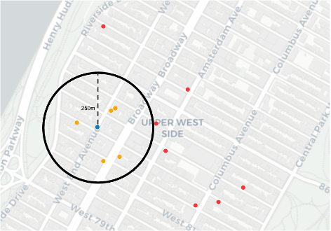

## The Effect of Market-Rate Housing Development on SurroundingHousing Prices: A Preliminary Study
Repo for all work related to research project around how rental prices change when a new market rate development is constructed nearby

	

Notebooks:
* **building_locations.ipynb:** Notebooks that uses geopandas to identify all buildings in the MDR dataset in proximity to new developments in the HPD dataset.
* **data_analysis.ipynb:** Cleaning up the scrapped data and performing an initial analysis which was then carried over to Tableu.
* **interactive_map.ipynb:** The interactive map used for Assignment 3.
* **model_linear_regression.ipynb:** Creating the hedonic regression model for which we can observe the DID estimator.
* **t-test.ipynb:** T-test that was run on amenities to justify the addition of the sparse variable into our model.

Data:
* **Housing_New_York_Units_by_Building.csv:** The HPD dataset that we used to gather new developments from NYC OpenData.
* **Multiple_Dwelling_Registrations.csv:** MDR dataset; contains of all registered rental buildings in NYC.
* **data_v-.pickle:** Versions of the non-cleaned web-scraped dataset. In the form of dictionaries of dictionaries.
* **test_set.csv:** Apartments chosen for the treatment and control to web-scrape.
* **apartment_data_compiled.csv:** Cleaned up version of the pickle data.
* **apartments_modeling_data.csv:** Cleaned data used for the hedonic regression.
* **apartments_price_change.csv:** Experimental dataset of using price-change instead of full-prices, was not used due to time constraints.

